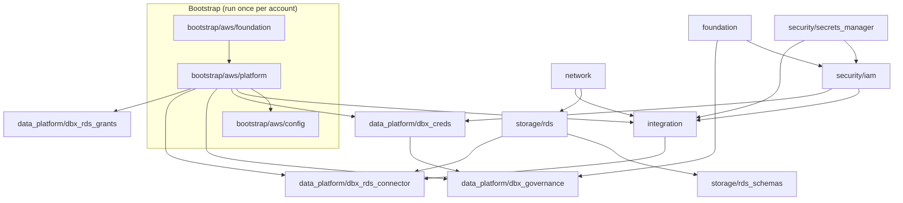
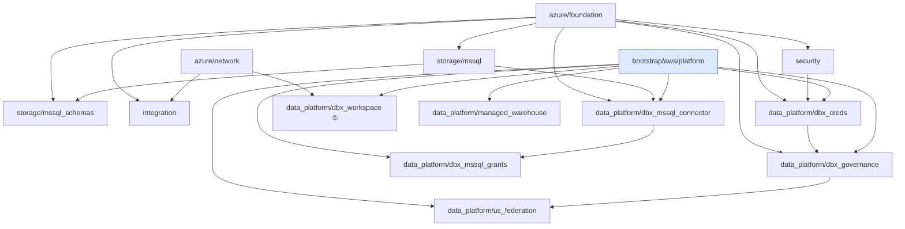
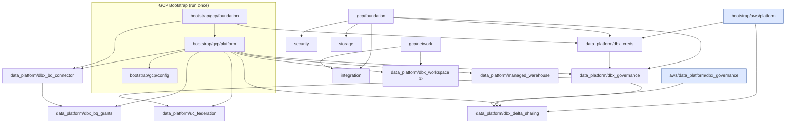

# Architecture & Design Decisions

## Why Terragrunt over a custom orchestrator

The previous version shipped a 913-line Python orchestrator that manually managed Terraform execution order, passed outputs between layers, injected secrets, and resolved domain JSON into variables. This is the exact problem Terragrunt was built to solve.

| Before | After |
|---|---|
| Python orchestrator (913 lines) | Terragrunt — 0 lines of orchestration code |
| YAML blueprint files | `terragrunt.hcl` dependency graphs |
| Manual context hydration | Native `dependency {}` output passing |
| `cloud_generations.json` entropy | Stable resource names (no suffix — [ADR-0013](docs/adr/0013-stable-names-over-deployment-id-suffix.md)) |
| 2-phase IAM (`is_initial_deployment`) | Single-phase with static `external_id` |
| `platform_bootstrap/ + gcp_platform_bootstrap/` | `bootstrap/aws/ + bootstrap/gcp/` |
| Local `.tfstate` files | Remote S3 + DynamoDB locking |
| No CI/CD | 4 GitHub Actions workflows |
| No pre-commit hooks | Checkov + tfsec + fmt on every PR |

---

## Architecture overview

```
┌─────────────────────────────────────────────────────────────────────┐
│  GitHub Actions (monorepo: .github/workflows/dbx-*.yml)             │
│  validate → bootstrap → deploy → destroy                            │
└──────────────────────┬──────────────────────────────────────────────┘
                        │  OIDC → AWS IAM Role
                        ▼
┌─────────────────────────────────────────────────────────────────────┐
│  Terragrunt (environments/dev/)                                     │
│  • reads config.hcl for all global values                           │
│  • runs run_cmd() to fetch secrets from AWS Secrets Manager         │
│  • parses domain JSON natively via jsondecode(file(...))            │
│  • builds DAG from dependency{} blocks, applies in correct order    │
└────────────┬─────────────────┬─────────────────┬───────────────────┘
             │                 │                 │
             ▼                 ▼                 ▼
         AWS stack         Azure stack       GCP stack
     (foundation→           (same)            (same)
      data_platform)
             │
             ▼
┌─────────────────────────────────────────────────────────────────────┐
│  Terraform modules (infra/)                                         │
│  • pure HCL — no providers, no backends                             │
│  • composed via _components/ sub-modules                            │
│  • provider blocks generated by Terragrunt at plan time             │
└─────────────────────────────────────────────────────────────────────┘
```

---

## Dependency graphs

### AWS



### Azure



### GCP



> `*` `dbx_workspace` creates a private managed workspace. When `is_private_connection = false` (default), it is a no-op — the module gates itself via `for_each = local.private_mode`. In public mode, `managed_warehouse` and `uc_federation` operate on the serverless workspace from bootstrap.

---

## Key design decisions

> Each decision below is also recorded as an immutable **Architecture Decision
> Record** in [docs/adr/](docs/adr/README.md) — the decision ledger (context →
> choice → consequences → alternatives). This section is the prose overview.

### 1. Secrets — never in code

All secrets are fetched at plan/apply time via `run_cmd` in Terragrunt locals:

```hcl
spn = jsondecode(run_cmd(
  "aws", "secretsmanager", "get-secret-value",
  "--secret-id", local.cfg.spn_secret_id,
  "--query", "SecretString", "--output", "text",
  "--region", local.cfg.aws_region
))
```

Azure Key Vault secrets are fetched with `az keyvault secret show`. GCP Secret Manager with `gcloud secrets versions access`. CI/CD uses AWS OIDC — no long-lived credentials anywhere.

### 2. Domain governance — zero Python

Previously Python parsed domain JSON and computed Terraform variables. Now Terragrunt does it natively:

```hcl
infra   = jsondecode(file("${get_terragrunt_dir()}/../../../domains/aws/sales_infra.json"))
grants  = jsondecode(file("${get_terragrunt_dir()}/../../../domains/aws/sales_grants.json"))
managed = [for c in local.infra.catalogs : c if c.type == "MANAGED"]
managed_schema_grants = [
  for g in local.grants.schema_grants : g
  if !contains(local.federated_names, split(".", g.schema)[0])
]
```

### 3. IAM — single-phase, static external_id

Eliminates the 2-phase IAM dance (`is_initial_deployment = true/false`). The external_id is the static AWS Account ID, known at design time. Both trust principals are set in a single `terraform apply`.

```hcl
external_id = var.aws_account_id  # known constant — no chicken-and-egg problem
```

### 4. Remote state — S3 + DynamoDB

Root `terragrunt.hcl` configures remote state globally. No child module defines a backend. State key follows the path hierarchy automatically via `path_relative_to_include()`.

```hcl
remote_state {
  backend = "s3"
  config = {
    bucket         = "dbx-platform-tfstate-${local.cfg.aws_account_id}"
    key            = "${path_relative_to_include()}/terraform.tfstate"
    dynamodb_table = "dbx-platform-tfstate-lock"
    encrypt        = true
  }
}
```

### 5. Providers — generated, never hardcoded

Each layer's `generate "providers"` block creates `provider.tf` at plan time using live dependency outputs (e.g., `workspace_url` from bootstrap). No provider block is committed to the repo.

### 6. Private vs public connectivity

A single toggle in `config.hcl` switches the entire platform between public and private connectivity:

```hcl
is_private_connection = false  # true = NCC/PrivateLink/Private Endpoints throughout
```

AWS: NCC rule + NLB proxy enabled. Azure: Private Endpoint + VNet Peering. GCP: VPN bridge. Workspace creation (`dbx_workspace` layer) is only triggered in private mode.

### 7. Delta Sharing — cross-cloud, native HCL

`gcp/data_platform/dbx_delta_sharing` shares GCP marketing catalog volumes with the AWS metastore. Uses dual Databricks provider aliases (one per cloud). The share map is built natively from `marketing_infra.json`:

```hcl
shared_schemas = distinct(flatten([
  for cat in local.infra.catalogs : [
    for s in lookup(cat, "schemas", []) : { catalog = cat.catalog_name, schema = s.schema_name }
    if anytrue([for v in lookup(s, "volumes", []) : lookup(v, "shared", false)])
  ] if cat.type == "MANAGED"
]))
```

---

## Domain model

| Cloud | Domain | Infra file | Grants file | Catalog type |
|---|---|---|---|---|
| AWS | sales | `sales_infra.json` | `sales_grants.json` | `sales_managed` (MANAGED) + `sales_rds_fed` (FEDERATED → RDS) |
| Azure | supply chain | `supply_infra.json` | `supply_grants.json` | `supplies_azure` (MANAGED) + `supply_sql_master` (FEDERATED → MSSQL) |
| GCP | marketing | `marketing_infra.json` | `marketing_grants.json` | `marketing_gcp` (MANAGED, delta-shared) + `marketing_bq_fed` (FEDERATED → BigQuery) |

---

## Project structure

```
databricks-platform-v2/
├── terragrunt.hcl                        # Root: S3 remote state + DynamoDB lock
├── Makefile                              # Developer targets (plan/apply/destroy/validate)
├── .pre-commit-config.yaml               # terraform fmt, hclfmt, checkov, tfsec, secret scan
├── README.md
│
├── environments/dev/
│   ├── config.hcl                        # Single source of truth for all config values
│   │
│   ├── domains/
│   │   ├── aws/{sales_infra,sales_grants}.json
│   │   ├── azure/{supply_infra,supply_grants}.json
│   │   └── gcp/{marketing_infra,marketing_grants}.json
│   │
│   ├── bootstrap/
│   │   ├── aws/{foundation,platform,config}/terragrunt.hcl
│   │   └── gcp/{foundation,platform,config}/terragrunt.hcl
│   │
│   ├── aws/
│   │   ├── foundation/
│   │   ├── security/{iam,secrets_manager}/
│   │   ├── network/
│   │   ├── storage/{rds,rds_schemas}/
│   │   ├── integration/
│   │   └── data_platform/{dbx_creds,dbx_governance,dbx_rds_connector,dbx_rds_grants}/
│   │
│   ├── azure/
│   │   ├── foundation/
│   │   ├── security/
│   │   ├── network/
│   │   ├── storage/{mssql,mssql_schemas}/
│   │   ├── integration/
│   │   └── data_platform/{dbx_creds,dbx_governance,dbx_mssql_connector,
│   │                       dbx_mssql_grants,dbx_workspace,managed_warehouse,uc_federation}/
│   │
│   └── gcp/
│       ├── foundation/
│       ├── security/
│       ├── network/
│       ├── storage/
│       ├── integration/
│       └── data_platform/{dbx_creds,dbx_governance,dbx_bq_connector,dbx_bq_grants,
│                           dbx_workspace,managed_warehouse,uc_federation,dbx_delta_sharing}/
│
└── infra/
    ├── aws/modules/
    │   ├── foundation/           # S3 + ECR (ECR gated on is_private_connection)
    │   │   └── _components/{s3_buckets,ecr_registry}/
    │   ├── security/{iam,secrets_manager}/
    │   ├── network/
    │   │   └── _components/rds_network/
    │   ├── storage/{rds,rds_schemas}/
    │   ├── integration/          # ECS/NLB proxy + NCC rule (private mode only)
    │   │   └── _components/{rds_gateway,aws_rds_ncc_rule}/
    │   └── data_platform/{aws_storage_credentials,dbx_rds_connector,
    │                       dbx_rds_grants,dbx_governance}/
    │
    ├── azure/modules/
    │   ├── foundation/ security/ network/
    │   ├── storage/{mssql,mssql_schemas}/
    │   ├── integration/
    │   └── data_platform/{azure_storage_credential,dbx_governance,dbx_mssql_connector,
    │                       dbx_mssql_grants,dbx_workspace,managed_warehouse,uc_federation}/
    │
    ├── gcp/modules/
    │   ├── foundation/ security/ network/ storage/ integration/
    │   └── data_platform/{gcp_storage_credentials,dbx_governance,dbx_bq_connector,
    │                       dbx_bq_grants,dbx_workspace,managed_warehouse,
    │                       uc_federation,dbx_delta_sharing}/
    │
    ├── databricks/modules/global/
    │   ├── catalog/
    │   ├── external_location/
    │   └── federated_grants/
    │
    └── bootstrap/modules/
        ├── aws_foundation/       # Cross-account IAM role + metastore S3 + KMS
        ├── aws_platform/         # Databricks metastore + serverless workspace (AWS)
        ├── gcp_foundation/       # GCS metastore bucket + GCP service account
        ├── gcp_platform/         # Databricks metastore + serverless workspace (GCP)
        ├── shared_config/        # Metastore-level grants + serverless SQL warehouse
        ├── shared_identities/    # SPN creation + group provisioning
        └── shared_secrets/       # KMS key + Secrets Manager secret for SPN
```
