# Multi-Cloud Governance Platform


[](https://github.com/theofanis-tsakanikas/multicloud-governance-platform/actions/workflows/dbx-config-validate.yml)
[](https://github.com/theofanis-tsakanikas/multicloud-governance-platform/actions/workflows/dbx-validate.yml)
[](LICENSE)
[](https://www.terraform.io/)
[](https://terragrunt.gruntwork.io/)
[](https://www.databricks.com/)
[](#snowflake--the-same-contract-a-second-engine)

**Data governance written once, in JSON, and enforced everywhere — across three clouds and two query
engines — by a gate that fails the pull request before a single resource exists.**

---

## Contents

| | |
|---|---|
| **[The gate](#governance-is-a-gate-not-a-report)** | A pull request that leaks PII fails the check before merge. It runs offline, in under a second |
| **[The architecture](#the-architecture)** | One JSON contract → three clouds → two engines |
| **[What it looks like when it runs](#what-it-looks-like-when-it-runs)** | Catalogs, the medallion, automatic lineage, cross-cloud Delta Sharing, three clouds side by side |
| **[The PII claim](#the-pii-claim-and-why-it-holds)** | Identities never leave Postgres, and the check returns zero rows |
| **[Private connectivity](#private-connectivity--three-clouds-no-public-path)** | Three transit hubs, zero public endpoints, proved at the packet level |
| **[Snowflake](#snowflake--the-same-contract-a-second-engine)** | The same contract, a second engine — reading the same bytes, zero copies |
| **[Genie](#genie--the-governance-copilot)** | It reasons, writes SQL, charts, cites — and declines what it may not know |
| **[Kept honest by CI](#kept-honest-by-ci)** | OIDC, no long-lived keys, secrets at plan time, Checkov/tfsec, SBOM, 137 tests — every push |
| **[Cost](#cost)** | Databricks, Snowflake, and three clouds priced into one figure and a carbon floor — offline |
| **[Run it](#run-it)** · **[What it does not do](#what-this-does-not-do)** · **[Decisions](#decisions)** | The commands, the honest limits, and the 16 decisions behind them |

---

## Governance is a gate, not a report

Most "governance" is a report. Somebody runs a scan, a dashboard turns amber, a ticket is filed, and
the grant that exposed a schema of customer emails has already been live for three weeks.

Here it is a **gate**. A pull request that grants a group `SELECT` on a schema classified `pii` fails
the check and turns red *before* review — not merged first and flagged later. Make that check
**required** in branch protection and the red becomes a wall: **it does not merge.**

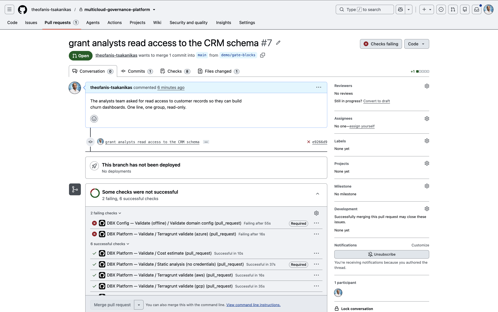

The check is the deterministic analyzer in [`scripts/policy_analyzer.py`](scripts/policy_analyzer.py).
It runs with **no cloud and no credentials** — on a laptop, or in a CI job that holds no secrets at all
— and it cannot be sidestepped by not deploying, because it runs *before* deploying is a thing that
could happen:

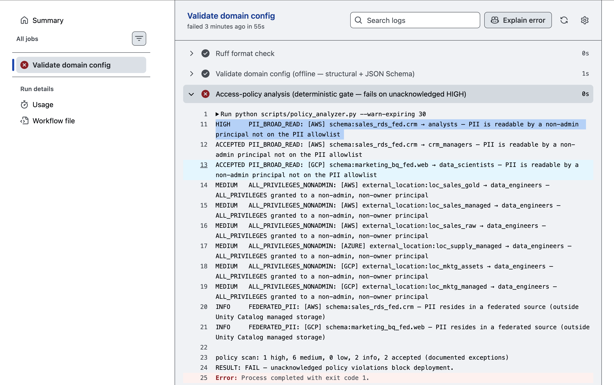

To prove the gate refuses more than one shape of mistake, the repository attacks it on every run — six
violations, each of which **must** be blocked:

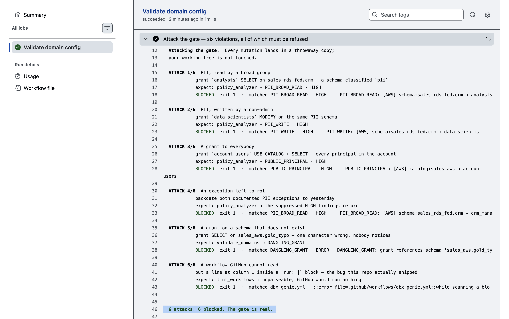

And it is not merely a wall. It is a **ledger**:

```jsonc
// environments/dev/policy_exceptions.json
{
  "rule":          "PII_BROAD_READ",
  "object":        "schema:sales_rds_fed.crm",
  "principal":     "crm_managers",
  "justification": "CRM operations require read access to service accounts. Read-only (SELECT),
                    scoped to crm_managers, covered by DPIA-2026-014.",
  "approved_by":   "data-protection-officer",
  "expires":       "2026-12-31"        // ← and on 2027-01-01, CI goes red again
}
```

An expired exception stops suppressing its finding and the build fails. That is not a bug. **Nobody
gets to grant themselves access to PII and quietly forget about it.**

> ### Governance isn't "no". It's *"not without a reason — and not forever."*

Fix the grant — or document it as an exception — and the same checks go green, and the pull request
merges:

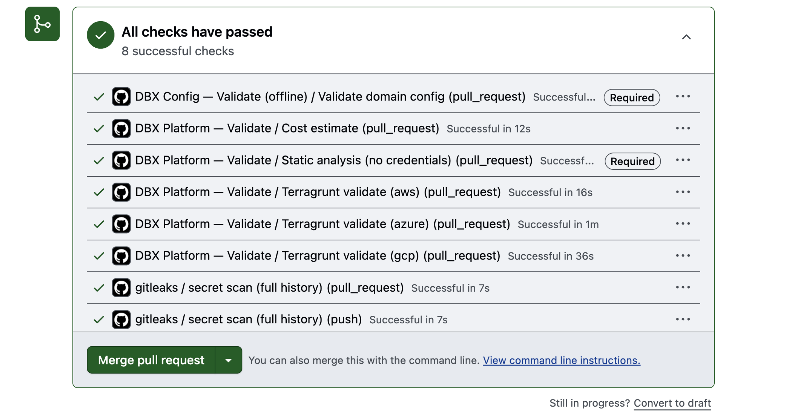

**Nine rules**, four of them gating. On the committed configuration the scan reads
`0 high · 6 medium · 0 low · 2 info · 2 accepted` — and the two accepted are the exception above and
its GCP twin. The same four gating rules are **re-implemented in OPA/Rego** and run against the
analyzer's own output in CI, so a bug in one engine cannot silently pass the other.

---

## The architecture


One JSON document per domain declares its storage, its catalogs, its schemas, its grants, and the
**classification** of everything in it. Terragrunt reads that JSON natively — `jsondecode(file(...))`,
no code generation, no Python on the apply path
([ADR-0006](docs/adr/0006-zero-python-domain-governance.md)) — and turns it into Unity Catalog objects
across three clouds, and into Snowflake grants alongside them.

**What is actually declared** — read out of the repository, not from memory:

| | |
|---|---|
| Clouds · domains | **3** (AWS · Azure · GCP) · **3** (`sales`, `supply_chain`, `marketing`) |
| Contract files | **6** — one `*_infra.json` + one `*_grants.json` per domain |
| Securables | **30** — 7 external locations, 6 catalogs, 13 schemas, 4 volumes |
| Grants | **70**, across **8** groups |
| PII schemas | **2** — `sales_rds_fed.crm`, `marketing_bq_fed.web`. *(Azure holds none.)* |
| Terraform modules | **87** · Workflows **11** · Decision records **16** |
| Tests | **137**, infrastructure-free, gating every push |

---

## What it looks like when it runs

Every screenshot below came out of the same JSON contract. Nothing here was configured by hand.

### Catalogs — managed, federated, and shared, side by side

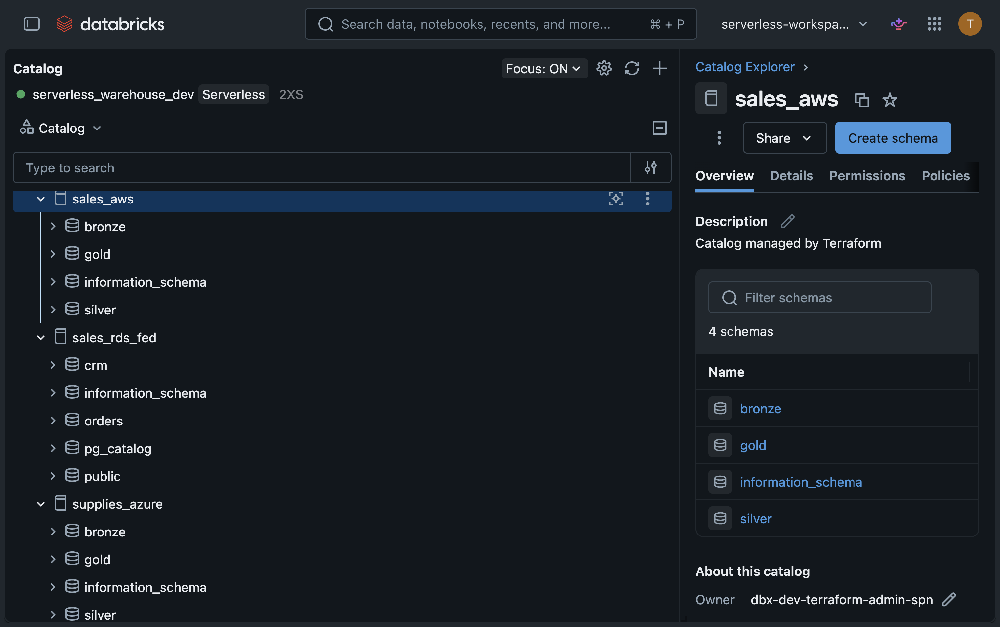

- **`sales_aws`, `supplies_azure`** — **MANAGED**: Delta tables in each cloud's own storage, with
  `bronze` / `silver` / `gold` schemas and a landing-zone volume.
- **`sales_rds_fed`, `supply_sql_master`** — **FOREIGN**: live federated views onto RDS Postgres and
  Azure SQL. No copy. Query them and the query runs *in the source engine*.
- **`shared_gcp_delta_share`** — a Delta Share received from the GCP metastore, across two Databricks
  accounts.

The right-hand panel says it plainly: *Catalog managed by Terraform*, owned by the deployment service
principal. There is no click-ops here to drift from.

### The medallion, run

Three SQL tasks — seed → medallion → executive — on a serverless warehouse. One minute, end to end,
with Unity Catalog tracing all twelve tables as it goes.


### The lineage Unity Catalog traced by itself

This is the picture worth the most. Nobody drew it: Unity Catalog followed the SQL.


Read it left to right. **Postgres** (`sales_rds_fed.orders`, `sales_rds_fed.crm`) and **SQL Server**
(`supply_sql_master.orders`, `supply_sql_master.inventory`) enter as federated sources. They become
bronze, then silver, then gold. A **Delta-Shared** table arrives from the GCP metastore
(`shared_gcp_delta_share.intelligence.gold_marketing_by_market`). All three converge into
`executive_cross_cloud`, which is then exported as Parquet for a fourth engine to read.

Look closely at `customers`: it carries `full_name`, `email`, `phone`. Look at `sales_clean`
immediately downstream: it carries `segment` and `signup_year`. **The PII minimisation is visible in
the graph.**

### The rejects — a quality gate that reports what it refused

The sources are seeded **deliberately dirty**, because a source that arrives clean makes the cleansing
stage theatre. Silver removes 220 of 6,040 bronze rows — and it *reports* what it removed, by rule,
rather than dropping them silently.

<table>
<tr>
<td width="50%"></td>
<td width="50%">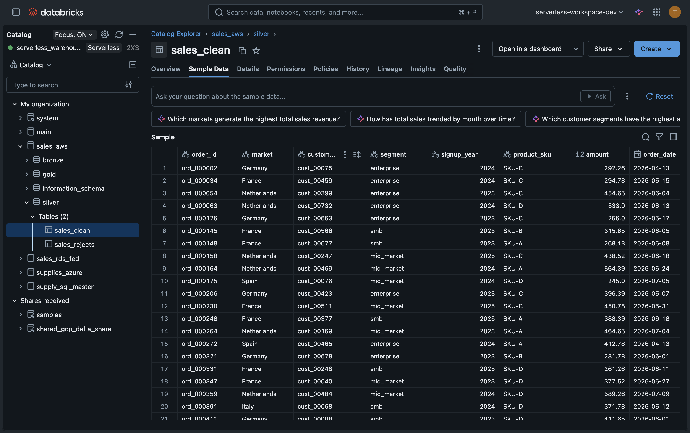</td>
</tr>
</table>

| Source | Tables | Deliberate defects |
|---|---|---|
| **RDS Postgres** | `crm.customers` (**800**, PII) · `orders.orders` (**6,040**) | 120 null markets · 61 refunds · 40 replays · 28 orphaned customers |
| **Azure SQL** | `inventory.stock` (24) · `orders.purchase_orders` (**4,040**) | 80 null markets · 41 returns · 40 replays |
| **BigQuery** | `analytics.sessions` (**20,000**) · `web.visitors` (**4,000**, PII) | 400 null markets |

*(The `orphan_customer` rows are relabelled `unknown`, not dropped — the table reports them, because a
governance platform that hides its own exceptions is not one. These figures are from the **live**
Databricks medallion; the offline `make data` runs a simpler sqlite medallion for the PII-in-gold proof
and does not reproduce this rejects table — see [pipelines/README.md](pipelines/README.md).)*

### The table three clouds agree on

The executive view is one SQL statement whose comment narrates the join: GCP demand meets AWS revenue
meets Azure supply, inner-joined on `market`, one row per market.

<table>
<tr>
<td width="50%">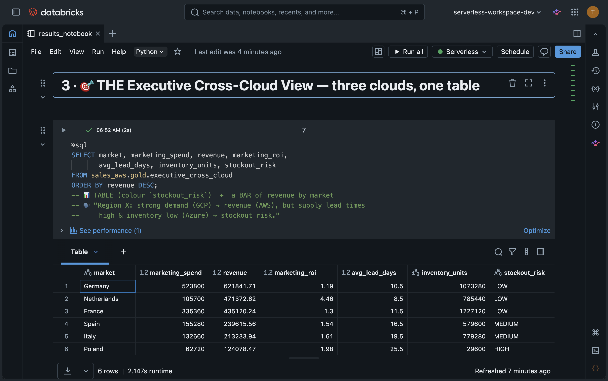</td>
<td width="50%"></td>
</tr>
</table>

Poland is the story: highest marketing ROI, longest lead times, 100% of stock below the reorder point.
**`stockout_risk = HIGH`, and every euro of its revenue is at risk.**

### The dashboard

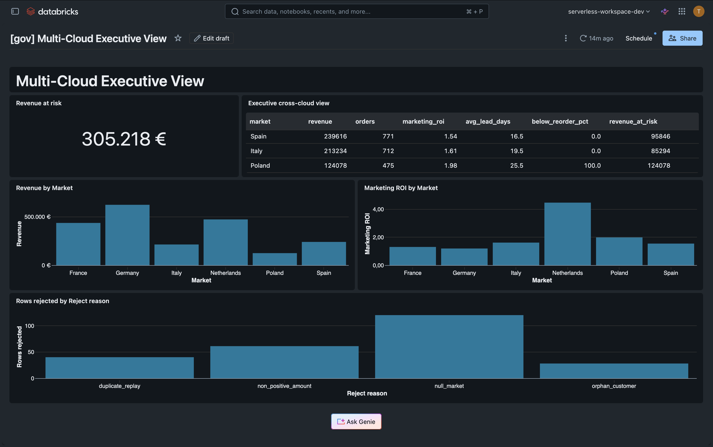

### Delta Sharing — GCP gold, read on AWS

The GCP medallion writes its gold table into the **GCP** metastore. The AWS workspace reads it as a
share, and the executive join treats it like any other table. Two Databricks accounts, two metastores,
one query.

<table>
<tr>
<td width="50%"></td>
<td width="50%">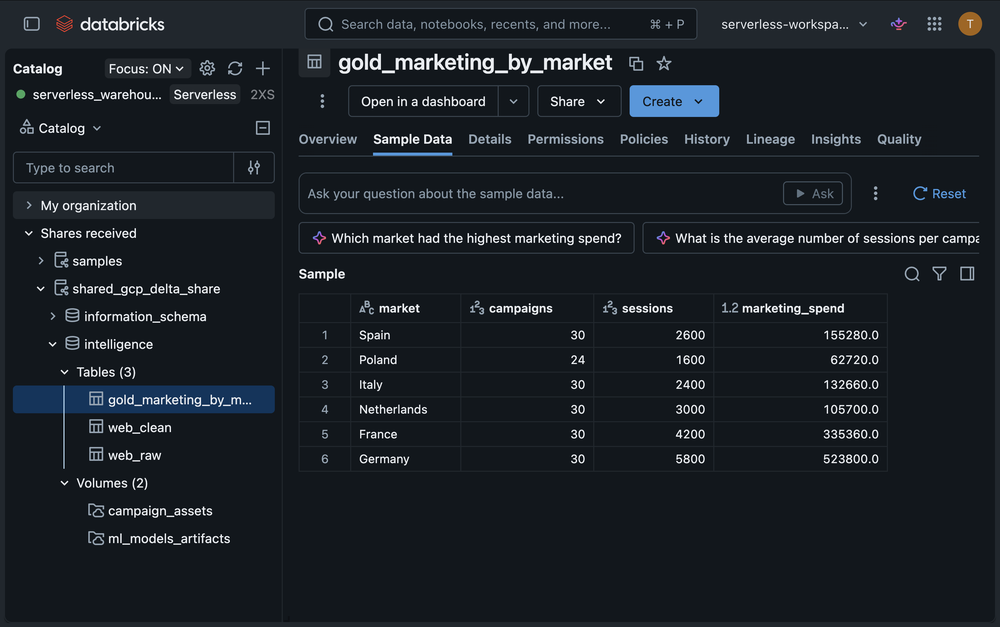</td>
</tr>
</table>

### The other two clouds, the same story

AWS is shown above because one cloud has to lead. Azure and GCP are the *same contract* on a different
provider — a federated source surfaced live in Unity Catalog, and a PII-minimised gold table on the far
side of the medallion.

**Azure — supply chain, from Azure SQL:**

<table>
<tr>
<td width="50%">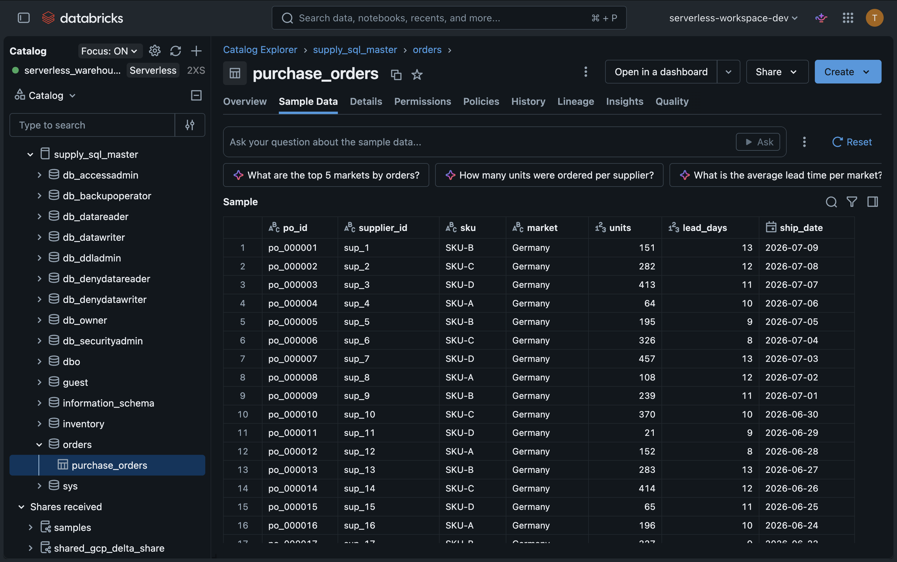</td>
<td width="50%">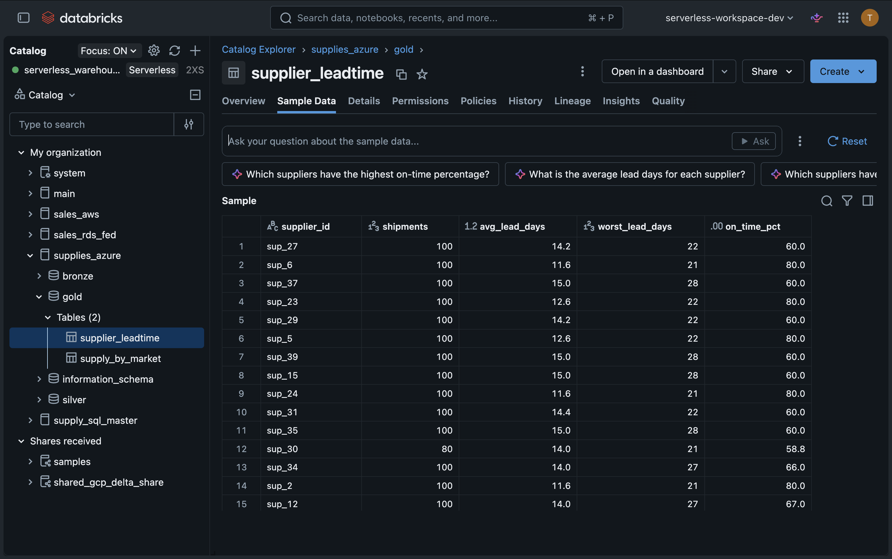</td>
</tr>
</table>

**GCP — marketing, from BigQuery:**

<table>
<tr>
<td width="50%">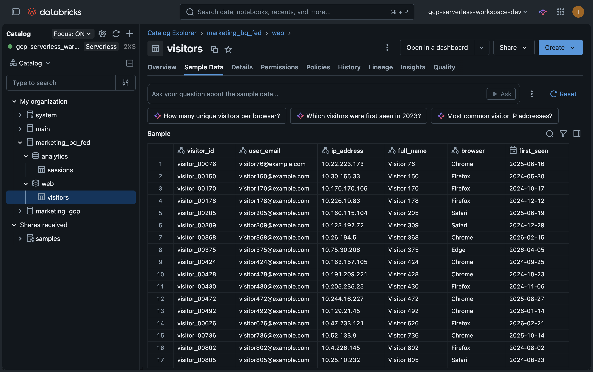</td>
<td width="50%">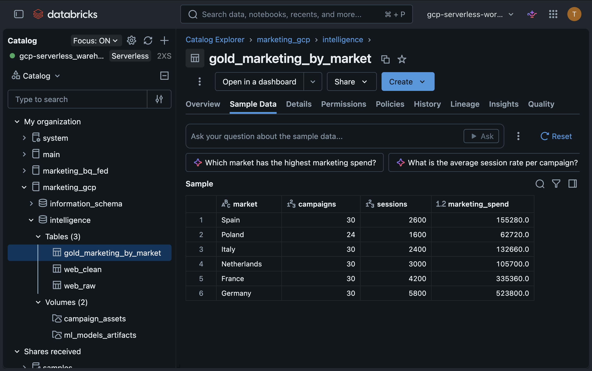</td>
</tr>
</table>

The BigQuery source carries `user_email`, `ip_address`, `full_name`. The gold table carries campaigns,
sessions, and spend by market — **and none of the three identifiers.**

---

## The PII claim, and why it holds

`crm.customers` carries `full_name`, `email`, `phone`. The medallion joins it — **inside Postgres,
through Lakehouse Federation** — and projects exactly two columns out of it: `segment` and
`signup_year`.

The strings `email`, `phone` and `full_name` appear in **no `SELECT` list anywhere in the pipeline**.
Nothing PII-shaped is ever written to managed storage. So the check is not a promise; it is a query you
can run — and it returns nothing:

<table>
<tr>
<td width="50%"></td>
<td width="50%">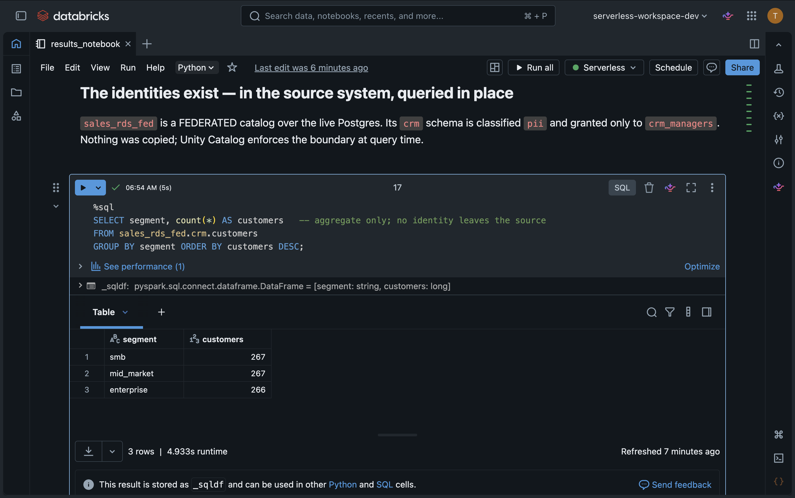</td>
</tr>
</table>

> **Left: no rows returned.** The gold tables carry zero PII. **Right: the identities still exist** —
> in the source system, queried in place through federation. They never entered the lakehouse.

To reach one, you must query the federated source directly — and that requires the `crm_managers`
grant, which required a signed, dated, expiring exception. The data below is real customer PII, read
live from RDS Postgres through Unity Catalog, and it is exactly what never reaches the gold layer:

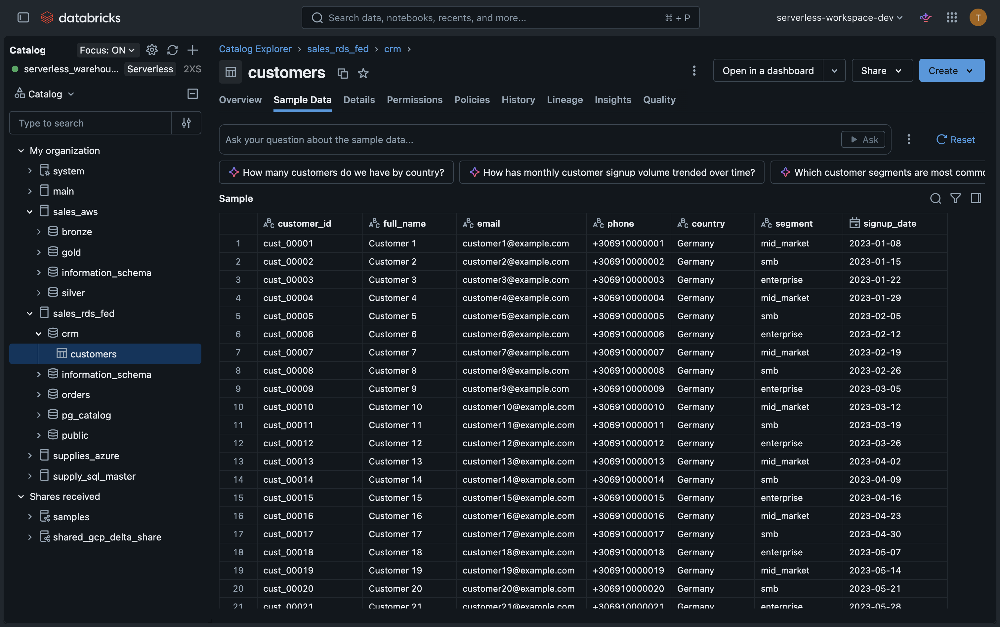

---

## Private connectivity — three clouds, no public path

Every cloud takes `skip | public | private`, **independently**. In public mode the `integration` layer
creates **zero resources** — an apply that finishes in seconds having built nothing is the correct
outcome, not a failure. In private mode, the database loses its front door entirely.


The proof is one screen. Three NCC private-endpoint rules, on one workspace, all `ESTABLISHED` — one to
RDS Postgres, one to Azure SQL, one to BigQuery:


And the doors are shut. Each database states its own closure, and answers a live query anyway — the
connection is coming in over the private path, not the internet:

<table>
<tr>
<td width="50%">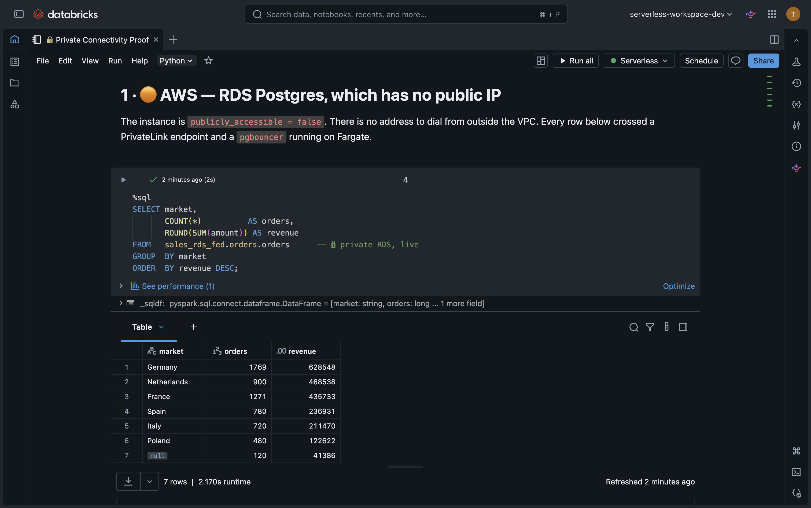</td>
<td width="50%">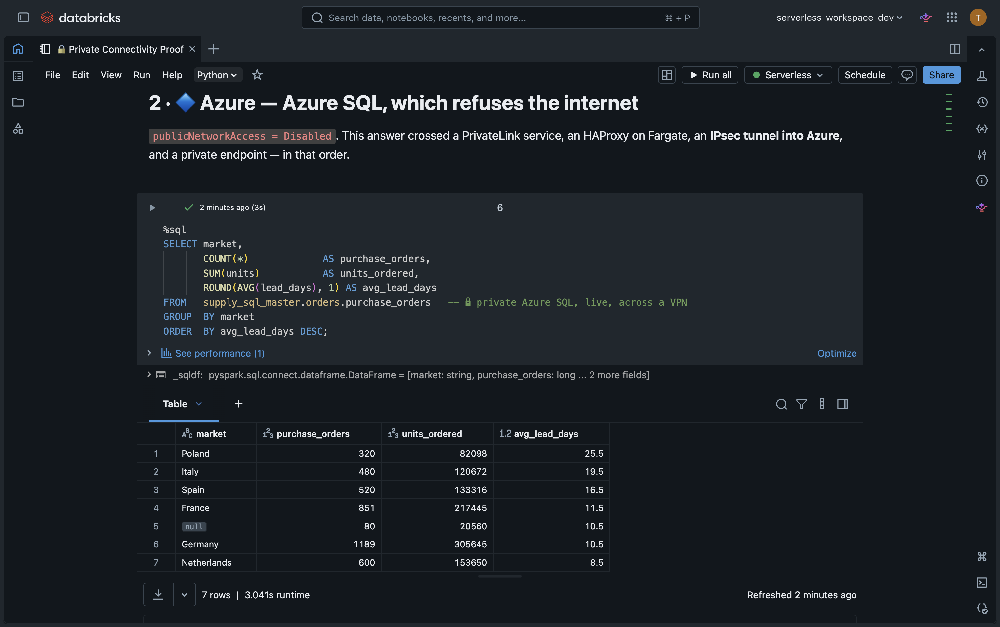</td>
</tr>
</table>

| | |
|---|---|
| **AWS · RDS Postgres** | `publicly_accessible = false` — **the instance has no public address at all** |
| **Azure · Azure SQL** | `publicNetworkAccess = Disabled` — **the server refuses the internet** |
| **GCP · BigQuery** | reached through Google's private API VIP `199.36.153.8/30`, across an IPsec tunnel |

### Why it needed a transit hub

Databricks serverless runs inside an **AWS** Databricks account, and an NCC private-endpoint rule can
only ever create an **AWS** endpoint. There is no way to ask it for a private endpoint into Azure SQL or
BigQuery. The feature does not exist. So the problem moved to ground where it does.


```
Databricks serverless (AWS)
  └─ NCC rule → AWS PrivateLink → internal NLB → ECS Fargate proxy
       └─ IPsec VPN → Azure private endpoint  /  Google's private API VIP
```

The proxies are TCP passthroughs. They terminate nothing, hold no credential, and understand no
protocol — the TLS session is end-to-end between Databricks and the database, and the proxy carries
bytes it cannot read.

### Proof, at the packet level

Configuration says what was *intended*. This says what actually **moved**:


`10.11.x` is the GCP transit hub; `10.10.x` is the Azure one. Both are private address space. A health
check carries **zero** bytes; these carry up to **1.9 MB**. 131 sessions, and not one of them touched
the internet. *(Preserved in [`docs/evidence/`](docs/evidence/private-connectivity.md) — the log groups
themselves expired a day later.)*

> **The honest footnote, and it matters:** BigQuery has **no "disable public access" switch**. It is a
> Google-managed API; there is nothing to turn off. What is private on that path is the **connection** —
> it travels through Google's private VIP and does not touch the internet. Removing BigQuery's public API
> surface altogether is VPC Service Controls, which this repository does not do.

*Per-cloud walkthroughs:* [AWS](images/prompts/prompt2.png) · [Azure](images/prompts/prompt6.png) ·
[GCP](images/prompts/prompt7.png) · [public vs private](images/prompts/prompt3.png)

---

---

# Snowflake — the same contract, a second engine

Everything above this line is **Databricks**. Everything below it is **Snowflake**, governed by the
*same JSON*, reading the *same bytes* ([ADR-0011](docs/adr/0011-snowflake-enforcement-backend.md)). The
connection uses key-pair (JWT) authentication — the service-account-correct method, and the one that
survives an account enforcing MFA ([ADR-0016](docs/adr/0016-snowflake-key-pair-auth.md)).

### One gold file. Two engines. Zero copies.


Databricks writes the gold layer once, as Parquet, into `s3://…/sales/gold-zone/executive/`. Snowflake
reads **that same object, in place**, through an external table over an external stage:

<table>
<tr>
<td width="50%"></td>
<td width="50%">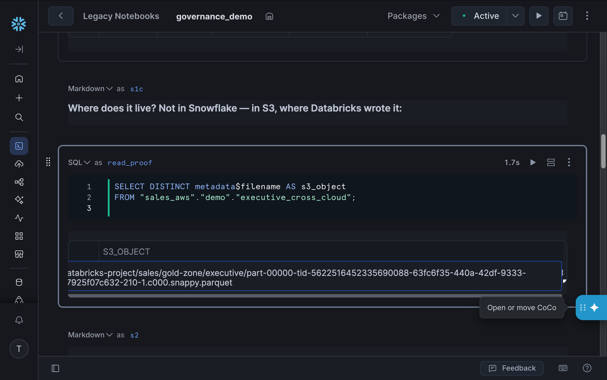</td>
</tr>
</table>

Same six markets. Same revenue. Same ROI. **A different engine, and not one byte copied.** The right
pane is the proof: `SELECT metadata$filename` returns the identical S3 key Databricks wrote. The
external location in Unity Catalog and the stage in Snowflake even **share a name** — `loc_sales_gold`
— because both are generated from the same contract.

### The governance travels with it

Because the contract drives Snowflake's grants too, the mechanisms exist on that side as well — account
roles, privilege grants, resource monitors, and **column masking**:

<table>
<tr>
<td width="50%">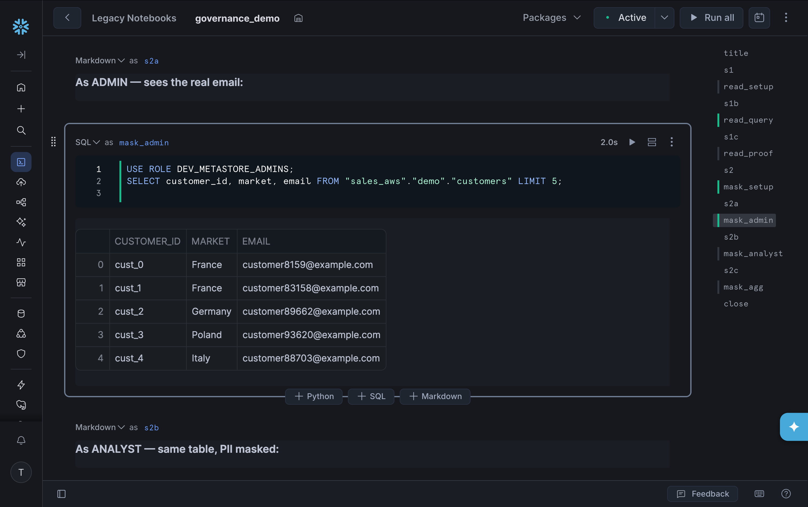</td>
<td width="50%">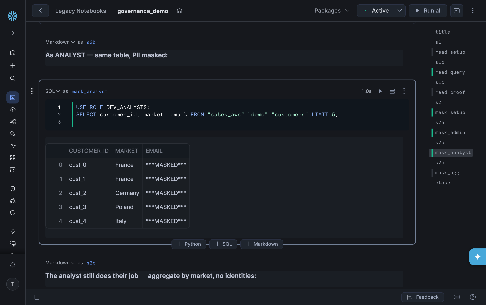</td>
</tr>
</table>

`DEV_METASTORE_ADMINS` sees the email. `DEV_ANALYSTS` sees `***MASKED***`. Same query, same table,
different role.

*(That demo schema generates its own synthetic PII on purpose. The **governed** catalogs have nothing
to mask, **because the PII never left Postgres** — which is exactly the point, and why the demo has to
invent some.)*

---

# Genie — the governance copilot

A Genie space over **four read-only tables** generated from the domain JSON. It is the *convenience*
tier of the platform, and it is deliberately subordinate to the deterministic core:

```
policy_analyzer.py   →  decides what is safe        (the trust — it fails the PR)
governance_report.py →  documents it                (accountability, on demand)
genie_space.py       →  lets a human ask in English (read-only convenience)
```

**The analyzer decides. Genie only restates what the analyzer already proved.**

### The cage: four tables, and nothing else


`objects` · `access_matrix` · `pii_map` · `policy_findings`. That is the entire world it can see. It
holds no credential, reads no business data, and cannot grant anything.

### It reasons, executes, writes the SQL, and cites


Asked *"which datasets hold PII, and who can read them across all three clouds?"* it plans a query, runs
it, and answers with a table and footnoted citations — and every answer carries a **Show code** link,
so it is SQL over governed tables you can read and rerun, not a black box producing prose. Note the
result: **Azure — no PII datasets.** It did not invent one to fill the gap.

### It charts what it found — from a query it shows you

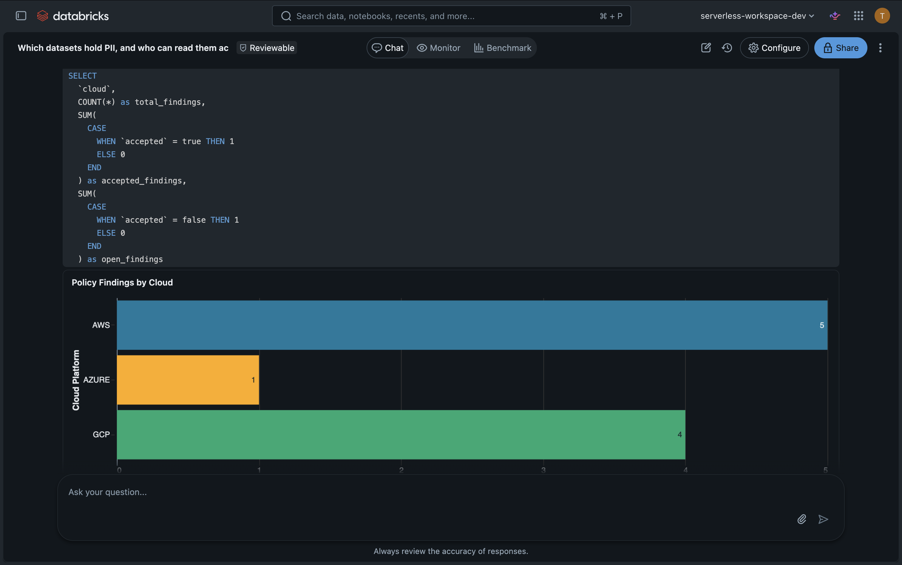

Findings by cloud, and the query behind the chart in the same frame. The **accepted exceptions read
straight out of the ledger**, with their DPIA justifications — the exception mechanism is not something
the AI was told about; it is a row in a table it can query.

### And it declines what it is not allowed to know


> **Q:** *What is the CEO's home address?*
>
> **A:** *"I cannot provide that information. As the governance copilot, I have **read-only access to
> metadata** about data governance — such as which datasets exist, their classifications, access grants,
> and policy findings. I do not have access to the underlying business data itself."*

**That refusal is the feature.** It is not that the AI answers; it is that it *knows what it is not
allowed to know* — and the boundary is not a promise made in a prompt. Genie queries as the human
asking, so Unity Catalog's own grants are the ceiling on anything it can return.

It also needs **no cloud stack**: its tables are facts read out of the JSON, in a managed catalog on the
metastore root. The copilot survived a full teardown of AWS, Azure and GCP. It describes the
*governance*, not the infrastructure.

```bash
make genie-deploy      # idempotent; needs only the bootstrap workspace + a SQL warehouse
```

---

## Kept honest by CI

The demo is the easy part. What makes this a platform and not a script is everything around it — and
all of it runs in CI, none of it holds a long-lived key.

- **Two required checks gate every pull request.** The credential-free policy gate above, and a
  static-analysis job — `terraform fmt`, `terragrunt hclfmt`, **Checkov**, **tfsec** — that fails the
  build on an insecure module. Neither can be skipped by choosing not to deploy.
- **OIDC everywhere, secrets nowhere.** Every cloud action authenticates with a short-lived OIDC token —
  there is no long-lived cloud key in any secret. Every credential the stack needs is fetched at plan
  time by shelling to the cloud's own CLI ([ADR-0002](docs/adr/0002-secrets-via-run-cmd-at-plan-time.md)),
  and none is ever written to Terraform state.
- **The supply chain is scanned, not assumed.** `gitleaks` reads the diff on every push and pull request
  and the full history weekly; an SBOM (Syft) and a CVE scan (Grype) publish to the Security tab.
- **137 tests gate every push** — infrastructure-free, so they run in seconds and need no cloud.
- **The docs cannot drift.** `docs/governance/` is generated from the contract, and CI fails the build if
  a committed byte is out of sync with the JSON.

Eleven workflows in [`.github/workflows/`](.github/workflows/) — you can read them; none of this is a claim.

---

## Run it

```bash
# Offline — no cloud, no credentials. This is the governance layer, whole.
make validate-config    # schema + consistency + wiring
make policy-scan        # the gate: exit 1 on any unacknowledged HIGH
make opa                # the same rules, cross-checked in Rego
make governance-report  # regenerate docs/governance/ (CI asserts it stays in sync)
make demo               # all of the above, end to end
pytest -q               # 137 tests

# Cloud — through GitHub Actions, not the CLI.
#   DBX Bootstrap  → metastore, serverless workspace, SPN, KMS, NCC  (once per account)
#   DBX Deploy     → per-cloud: skip | public | private
#   DBX Pipeline   → seed the sources, run the medallion, publish the dashboard
#   DBX Genie      → provision the governance copilot (needs no cloud stack)
#   DBX Destroy    → reverse-order teardown; never touches bootstrap
```

### Layout

```
environments/dev/domains/                  ← THE CONTRACT. Everything else is a consequence.
environments/dev/policy_exceptions.json    ← documented, time-bound, expiring
scripts/                                   ← the gate + the report + the copilot (offline, stdlib)
policy/opa/                                ← the gating rules, re-implemented in Rego
schema/                                    ← JSON Schema for the contract (Draft 2020-12)
infra/{aws,azure,gcp,databricks,bootstrap,snowflake}/modules/    ← 87 modules
environments/{dev,prod}/                   ← Terragrunt wiring; prod is a file-for-file mirror
pipelines/                                 ← the medallion (Databricks SQL) + the simulated sources
docs/adr/                                  ← 16 decision records
docs/governance/                           ← GENERATED. CI fails if it drifts from the contract.
```

---

## What this does **not** do

A portfolio that only lists what works is a sales page. This is the rest of it.

- **`prod/` has never been applied.** It mirrors `dev/`
  ([ADR-0010](docs/adr/0010-environments-as-file-mirrors.md)) — file-for-file, save for its own
  `config.hcl` (placeholders, `aws_account_id = "111111111111"`), a couple of documented safety deltas
  (no `force_destroy`, no `drop_cascade`), the dev-only Snowflake layer, and the dev-only offline-tooling
  inputs (`policy_exceptions.json`, `cost_assumptions.json`). The architecture supports promotion by
  config diff. Nobody has done it.
- **The OPA cross-check re-implements all 4 gating rules** in Rego — a second engine (run in CI) that
  reaches the same verdict as the analyzer. It re-derives the *logic* independently, but reads the
  analyzer's own output (`governance_context.json`) as its *facts*, so it is a rule-logic cross-check,
  not a from-scratch second pipeline.
- **The gate does not fail on MEDIUM.** Six `ALL_PRIVILEGES_NONADMIN` findings are open today and CI is
  green. `--strict` would fail them; CI does not pass `--strict`. A deliberate posture, stated rather
  than hidden.
- **Live drift detection is not wired up.** `catalog_drift.py --live` is implemented and unit-tested
  against synthetic data; it has never run against a real Unity Catalog in CI. A grant changed by hand in
  the UI will not be caught.
- **The offline `pipelines/` sqlite demo is a different pipeline.** It shares the *governance model* with
  the Databricks medallion — not the data model. Different tables, different columns, no dirty data. It
  exists so the governance story runs with no cloud at all.
- **The source systems are simulated**, and the boundary is explicit
  ([ADR-0014](docs/adr/0014-simulated-source-systems.md)). A real platform does not own its OLTP sources;
  pretending otherwise would be the lie that makes everything else suspect.
- **BigQuery's public API surface still exists.** See the footnote above.

---

## Cost

`scripts/cost_estimate.py` prices the whole platform — Databricks compute, Snowflake credits, and all
three clouds — into one figure and a carbon floor, **offline, before a single resource exists**:

```
~$2,646 / month   ·   ~79 kg CO₂e / month        →  docs/governance/COST.md
```

Every price is an illustrative placeholder, declared as such in
`environments/dev/cost_assumptions.json`. It is a floor for awareness, not a quote.

---

## Decisions

Sixteen ADRs in [`docs/adr/`](docs/adr/) record what was chosen and — more usefully — what was rejected,
and one records what building it proved **wrong** ([ADR-0008](docs/adr/0008-single-connectivity-toggle.md)
said one connectivity toggle; there are three).

| | |
|---|---|
| [0001](docs/adr/0001-terragrunt-over-custom-orchestrator.md) | Terragrunt instead of a hand-rolled Python orchestrator — the DAG is declared, not coded |
| [0006](docs/adr/0006-zero-python-domain-governance.md) | The domain contract is JSON that Terragrunt reads natively. No code generation |
| [0007](docs/adr/0007-deterministic-governance-bounded-llm.md) | The deterministic analyzer decides and gates. The LLM is bounded on top of it |
| [0011](docs/adr/0011-snowflake-enforcement-backend.md) | Snowflake as a second enforcement backend for the same contract |
| [0014](docs/adr/0014-simulated-source-systems.md) | The OLTP sources are simulated, and the boundary is explicit |
| [0016](docs/adr/0016-snowflake-key-pair-auth.md) | The Snowflake provider authenticates by key-pair, not password — it survives account MFA |

---

## Security

Vulnerability reporting, scope, and the known limitations: [SECURITY.md](SECURITY.md).

## License

[MIT](LICENSE).
