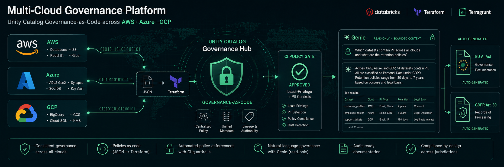

# Multi-Cloud Governance Platform



[](https://github.com/theofanis-tsakanikas/multicloud-governance-platform/actions/workflows/dbx-validate.yml)
[](https://github.com/theofanis-tsakanikas/multicloud-governance-platform/actions/workflows/dbx-config-validate.yml)
[](LICENSE)
[](https://www.terraform.io/)
[](https://terragrunt.gruntwork.io/)
[](https://www.databricks.com/)
[](https://github.com/theofanis-tsakanikas/multicloud-governance-platform)

Enterprise-grade, fully automated Databricks Unity Catalog governance across AWS, Azure, and GCP.

---

## Table of contents

- [What this demonstrates](#what-this-demonstrates)
- [Architecture](#architecture)
- [Stack](#stack)
- [Prerequisites](#prerequisites)
- [Quick start](#quick-start)
- [CI/CD](#cicd)
- [Adding a new domain](#adding-a-new-domain)
- [After a full destroy](#after-a-full-destroy)

---

## What this demonstrates

This project is a reference implementation of production-grade, multi-cloud data platform provisioning. It was built to demonstrate the following engineering patterns:

| Pattern | Implementation |
|---|---|
| **Multi-cloud IaC without a custom orchestrator** | Terragrunt `dependency {}` blocks build a DAG across all layers and clouds; `run-all apply` executes in correct order automatically |
| **Zero-Python domain governance** | Unity Catalog schemas, grants, and external locations are defined in JSON and wired to Terraform via `jsondecode(file(...))` — no code generation step |
| **Secrets never in code** | `run_cmd` fetches all secrets from AWS Secrets Manager at plan time; no secrets in state, no env var injection |
| **OIDC-based CI with no long-lived credentials** | GitHub Actions assumes an AWS IAM role via OIDC; Azure uses federated identity; GCP seeds from AWS Secrets Manager |
| **Cross-cloud Delta Sharing** | GCP marketing catalog is shared to the AWS metastore using dual Databricks provider aliases and native HCL logic |
| **Responsible-AI governance copilot** | A deterministic least-privilege / PII analyzer gates CI, generates EU-AI-Act / GDPR documentation from the config, and grounds a single cross-cloud Genie NL layer — trust-first, LLM bounded ([docs/governance/](docs/governance/README.md)) |
| **Provable governance, two engines** | The policy gate is backed by a golden test corpus and an independent OPA/Rego re-implementation ([policy/opa/](policy/opa/README.md)); findings publish as SARIF to the GitHub Security tab |
| **Versioned config contract** | Domain JSON is validated against published [JSON Schema](schema/README.md) (Draft 2020-12) with editor autocomplete, on top of the structural validator |
| **Governance telemetry + FinOps** | Trendable [metrics](docs/governance/metrics.json) (posture/coverage/expiring exceptions) and a multi-cloud [cost + carbon floor](docs/governance/COST.md) that fills Infracost's Databricks/Azure/GCP blind spots |
| **Security scanning in CI** | Checkov, tfsec, gitleaks, plus an SBOM + vulnerability scan ([sbom.yml](.github/workflows/sbom.yml)) on every change; pre-commit hooks enforce the same locally |
| **Cost estimation in CI** | Infracost posts an AWS infrastructure cost breakdown as a PR comment on every change |
| **Governance over data in motion** | A deterministic synthetic-data generator + a real bronze→silver→gold medallion (stdlib `sqlite3`, offline) prove the claims: PII is minimised out of gold, observed data is reconciled against declared classification, and one KPI table spans all three clouds ([pipelines/](pipelines/README.md)) |
| **Self-contained dashboard** | A static, no-JS, no-server [governance dashboard](docs/governance/dashboard/index.html) renders posture, PII map, data reconciliation and cost from the committed artifacts — published to GitHub Pages |
| **Decisions on the record** | Every significant choice is captured as an [ADR](docs/adr/README.md); a [dev container](.devcontainer/README.md) + `make demo` runs the whole offline governance story in ~30s, no cloud |

Full architecture detail, dependency graphs, and design decisions are in [ARCHITECTURE.md](ARCHITECTURE.md). Operational gotchas and secrets flow are in [CLAUDE.md](CLAUDE.md).

---

## Architecture

| Layer | AWS | Azure | GCP |
|---|---|---|---|
| Foundation | S3 + KMS + ECR | ADLS Gen2 + Key Vault | GCS + IAM |
| Security | IAM + Secrets Manager | Service Principal | Service Account + WIF |
| Network | VPC + RDS subnets | VNet + Subnets | VPC + Subnets |
| Storage | RDS PostgreSQL 15 | Azure SQL (MSSQL) | BigQuery |
| Integration | ECS/PgBouncer + NCC | VNet Peering | BigQuery Connector |
| Data Platform | Storage Creds + Connectors + Governance | ← | ← |

## Stack

- **Terragrunt** orchestrates Terraform layers with automatic dependency resolution
- **Remote state** in S3 with DynamoDB locking
- **Secrets** fetched at plan/apply time from AWS Secrets Manager — never stored in code
- **Domain governance** defined in JSON, loaded natively by Terragrunt — no custom code

## Prerequisites

- Terraform ≥ 1.10
- Terragrunt ≥ 0.75
- AWS CLI configured (with access to `387229419515`)
- Bootstrap completed (`make bootstrap-aws`)

## Environments

`environments/dev/` and `environments/prod/` are file-for-file mirrors — every layer
reads its values from the nearest `config.hcl`, so promotion is a config diff, not an
architecture change. Select with `make plan-aws ENV=prod` (default `dev`). See
[environments/prod/README.md](environments/prod/README.md) for the production checklist.

## Quick start

```bash
# First time only — bootstrap the Databricks account
make bootstrap-aws
make bootstrap-gcp

# Preview what will be deployed
make plan-aws

# Deploy
make apply-aws

# Deploy a single layer
make apply LAYER=aws/security/iam

# Destroy (confirms before running)
make destroy-aws
```

## CI/CD

GitHub Actions workflows in `.github/workflows/`:

| Workflow | Trigger |
|---|---|
| `dbx-validate.yml` | Every PR touching `infra/**`, `environments/**`, or `terragrunt.hcl` — fmt, validate, Checkov, tfsec, Infracost |
| `dbx-config-validate.yml` | PR touching domains/scripts/docs — **credential-free**: domain validator + the access-policy gate + report/Genie `--check` + pytest |
| `dbx-bootstrap.yml` | Manual: bootstrap AWS or GCP |
| `dbx-deploy.yml` | Manual: deploy one or all clouds |
| `dbx-destroy.yml` | Manual: destroy with "DESTROY" confirmation |
| `dbx-drift.yml` | Weekly schedule: `terragrunt plan -detailed-exitcode` per cloud; opens a `drift` issue on differences |
| `sbom.yml` | Push / weekly: generate an SPDX SBOM (Syft) + scan deps for CVEs (Grype) → Security tab |
| `pages.yml` | Push to main: rebuild + publish the static governance dashboard to GitHub Pages |

Required GitHub secrets: `DBX_DEPLOY_ROLE_ARN`, `AZURE_CLIENT_ID`, `AZURE_TENANT_ID`, `AZURE_SUBSCRIPTION_ID`

## Adding a new domain

1. Add `environments/dev/domains/<cloud>/<domain>_infra.json` (classify schemas with `classification`, set the catalog `owner`)
2. Add `environments/dev/domains/<cloud>/<domain>_grants.json`
3. Update the `domain_path` locals in the relevant `data_platform/dbx_governance/terragrunt.hcl`
4. Run `make policy-scan` to check the new grants against the least-privilege / PII rules, then `make governance-report`
5. Run `make apply LAYER=<cloud>/data_platform/dbx_governance`

## Governance copilot

The platform ships a Responsible-AI governance layer over the catalog — a deterministic access-policy analyzer (CI gate), auto-generated EU-AI-Act / GDPR documentation, and a single cross-cloud Genie NL interface grounded on that analysis. All offline and credential-free. See [docs/governance/](docs/governance/README.md) and the generated [REPORT.md](docs/governance/REPORT.md).

```bash
make demo                 # run the whole offline pipeline end-to-end (no cloud, ~30s)
make policy-scan          # least-privilege / PII analysis (fails on unacknowledged HIGH)
make governance-report    # regenerate the governance docs + metrics + cost + Genie pack
make metrics              # governance telemetry (posture / coverage / expiring exceptions)
make cost-estimate        # multi-cloud + Databricks cost & carbon floor
make opa                  # cross-check the gate with the OPA/Rego policy (needs conftest)
make policy-sarif         # write policy.sarif for the GitHub Security tab
make data                 # synthetic data → medallion (bronze/silver/gold) → profile
make dashboard            # render the static, self-contained governance dashboard
```

## After a full destroy

Update `deployment_id_<cloud>` in `environments/dev/config.hcl` to prevent resource name collisions on re-deploy.
