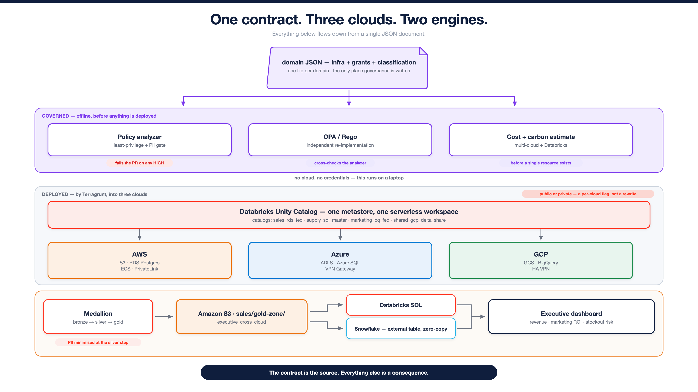
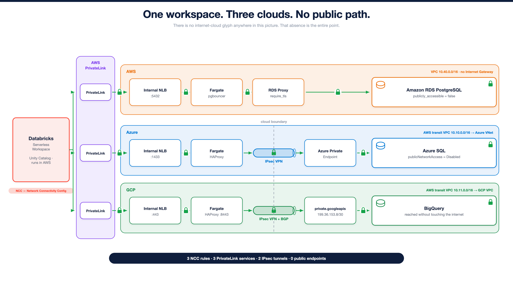
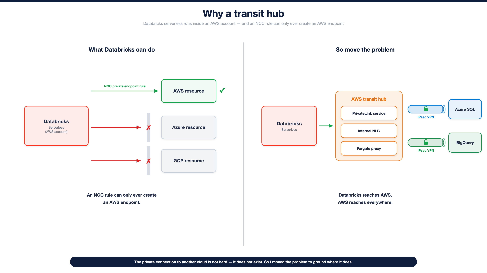
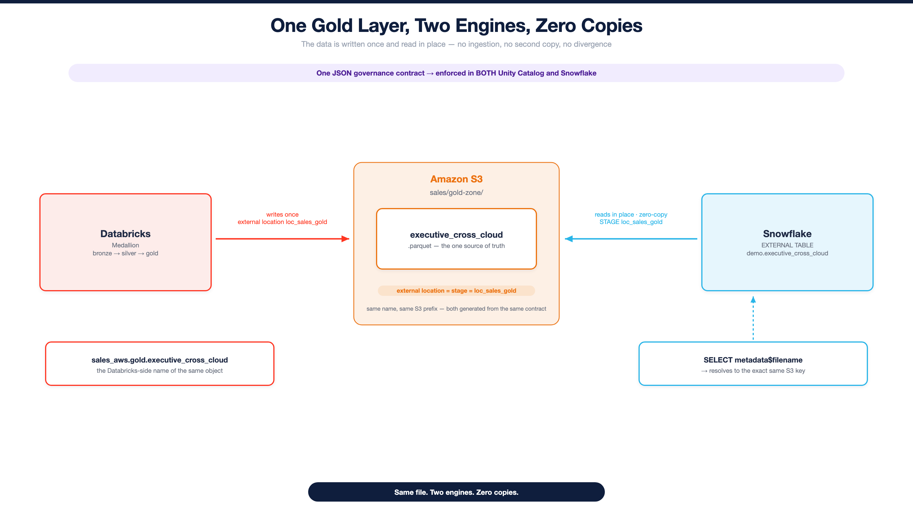

# Multi-Cloud Governance Platform


[](https://github.com/theofanis-tsakanikas/multicloud-governance-platform/actions/workflows/dbx-config-validate.yml)
[](https://github.com/theofanis-tsakanikas/multicloud-governance-platform/actions/workflows/dbx-validate.yml)
[](LICENSE)
[](https://www.terraform.io/)
[](https://terragrunt.gruntwork.io/)
[](https://www.databricks.com/)
[](#the-architecture)

**Data governance defined once, in JSON, and enforced everywhere — across three clouds and two query
engines — by a gate that fails the pull request before a single resource exists.**

---

## The thing worth understanding first

Most "governance" is a report. Somebody runs a scan, a dashboard turns amber, a ticket gets filed,
and the grant that leaked a schema of customer emails has been live for three weeks.

Here, governance is a **gate**. A pull request that grants a group `SELECT` on a schema classified
`pii` does not get merged and then flagged. **It does not merge.**

```
$ python scripts/policy_analyzer.py
[HIGH]  PII_BROAD_READ   schema:sales_rds_fed.crm → analysts
        PII is readable by a non-admin principal

policy scan: 1 high, 6 medium, 0 low, 2 info, 2 accepted
RESULT: FAIL                                                    ← exit 1, the PR is red
```

It runs with **no cloud and no credentials** — on a laptop, in under a second, in a CI job that has
no secrets at all. It cannot be skipped by not deploying, because it runs *before* deploying is a
thing that could happen.

And it is not a wall. It is a **ledger**:

```jsonc
// environments/dev/policy_exceptions.json
{
  "rule":        "PII_BROAD_READ",
  "object":      "schema:sales_rds_fed.crm",
  "principal":   "crm_managers",
  "justification": "CRM operations require read access to service accounts. Read-only (SELECT),
                    scoped to crm_managers, covered by DPIA-2026-014.",
  "approved_by": "data-protection-officer",
  "expires":     "2026-12-31"          // ← and on 2027-01-01, CI goes red again
}
```

An expired exception stops suppressing its finding, and the build fails. That is not a bug. Nobody
gets to grant themselves access to PII and quietly forget about it.

> **Governance isn't "no". It's "not without a reason — and not forever."**

---

## The architecture



One JSON document per domain declares its storage, its catalogs, its schemas, its grants, and the
**classification** of everything in it. Terragrunt reads that JSON natively — `jsondecode(file(...))`,
no code generation, no Python on the apply path ([ADR-0006](docs/adr/0006-zero-python-domain-governance.md))
— and turns it into Unity Catalog objects across three clouds and into Snowflake grants alongside them.

**What is actually declared** (read from the repo, not from memory):

| | |
|---|---|
| Clouds · domains | **3** (AWS · Azure · GCP) · **3** (`sales`, `supply_chain`, `marketing`) |
| Contract files | **6** — one `*_infra.json` + one `*_grants.json` per domain |
| Securables | **30** — 7 external locations, 6 catalogs, 13 schemas, 4 volumes |
| Grants | **70**, across **8** groups |
| PII schemas | **2** — `sales_rds_fed.crm`, `marketing_bq_fed.web`. *(Azure holds none.)* |
| Terraform modules | **87**, under `infra/` |
| Workflows | **11** |
| Decision records | **15** ADRs |
| Tests | **135** — infra-free, gating every push |

---

## Public or private — a per-cloud flag, not a rewrite

Every cloud takes `skip | public | private`, independently. In **public** mode the `integration`
layer creates **zero resources** — an apply that finishes in seconds having built nothing is the
correct outcome, not a failure.

In **private** mode, the database loses its front door entirely.



| | |
|---|---|
| 🟠 **AWS · RDS Postgres** | `publicly_accessible = false` — **the instance has no public address at all** |
| 🔷 **Azure · Azure SQL** | `publicNetworkAccess = Disabled` — **the server refuses the internet** |
| 🔵 **GCP · BigQuery** | reached through Google's private API VIP `199.36.153.8/30`, across an IPsec tunnel |

Three NCC private-endpoint rules, all `ESTABLISHED`, on one workspace:


### Why it needed a transit hub

Databricks serverless runs inside an **AWS** Databricks account, and an NCC private-endpoint rule can
only ever create an **AWS** endpoint. There is no way to ask it for a private endpoint into Azure SQL
or BigQuery. The feature does not exist.

So the problem moved to ground where it does exist.



```
Databricks serverless (AWS)
  └─ NCC rule → AWS PrivateLink → internal NLB → ECS Fargate proxy
       └─ IPsec VPN → Azure private endpoint / Google's private API VIP
```

The proxies are TCP passthroughs. They terminate nothing, hold no credential, and understand no
protocol — the TLS session is end-to-end between Databricks and the database, and the proxy carries
bytes it cannot read.

**The honest footnote, and it matters:** BigQuery has **no "disable public access" switch**. It is a
Google-managed API; there is nothing to turn off. What is private on that path is the **connection** —
it travels through Google's private VIP and does not touch the internet. Removing BigQuery's public
API surface altogether is VPC Service Controls, which this repo does not do.

*Full walkthroughs: [AWS](images/diagrams/02-aws-private-connection.png) ·
[Azure](images/diagrams/06-azure-private-connection.png) ·
[GCP](images/diagrams/07-gcp-private-connection.png) ·
[public vs private](images/diagrams/03-public-vs-private-side-by-side.png)*

---

## The data, and what governance does to it

The source systems are **simulated on purpose, and fenced off explicitly**
([ADR-0014](docs/adr/0014-simulated-source-systems.md)) — a real platform does not own its OLTP
sources, and pretending otherwise would be the lie that makes everything else suspect. They are
seeded deterministically, and they are seeded **dirty**, because a source that arrives clean makes the
cleansing stage theatre:

| Source | Tables | Deliberate defects |
|---|---|---|
| **RDS Postgres** | `crm.customers` (**800**, PII) · `orders.orders` (**6,040**) | 120 null markets · 61 refunds · 40 replays · 28 orphaned customers |
| **Azure SQL** | `inventory.stock` (24) · `orders.purchase_orders` (**4,040**) | 80 null markets · 41 returns · 40 replays |
| **BigQuery** | `analytics.sessions` (**20,000**) · `web.visitors` (**4,000**, PII) | 400 null markets |

A medallion runs over them — bronze → silver → gold — and lands in one table that joins **three
clouds**: AWS sales (Delta) ⋈ Azure supply (Delta) ⋈ GCP marketing (**Delta-Shared**).


### The PII claim, and why it holds

`crm.customers` carries `full_name`, `email`, `phone`. The medallion joins it — **in Postgres, through
Lakehouse Federation** — and projects exactly two columns out of it: `segment` and `signup_year`.

The strings `email`, `phone` and `full_name` **appear in no `SELECT` list anywhere in the pipeline**.
Nothing PII-shaped is ever written to managed storage. The identities stay where they were born, and
a query against `sales_aws.information_schema.columns` for `email|phone|ip|ssn|name` in `gold` and
`silver` returns **zero rows** — a check that ships as two cells of the results notebook, so you can
run it rather than believe it.

---

## One gold file. Two engines. Zero copies.



Databricks writes the gold layer once, as Parquet, into `s3://…/sales/gold-zone/executive/`.
Snowflake reads **that same object, in place**, through an external table over an external stage — and
`SELECT metadata$filename` proves it is the same S3 key. No ingestion, no second copy, no divergence.

The external location in Unity Catalog and the stage in Snowflake share a name — `loc_sales_gold` —
and that is not a coincidence. Both are generated from the same contract
([ADR-0011](docs/adr/0011-snowflake-enforcement-backend.md)).

---

## The AI, and what it is not allowed to do


A Genie space sits over **four read-only tables** generated from the domain JSON: `objects`,
`access_matrix`, `pii_map`, `policy_findings`. It answers questions about governance in English, with
citations.

Asked which datasets hold PII across three clouds, it names both, names their readers, and volunteers
that **the third cloud has none** — rather than inventing one.

Asked for the CEO's home address, it declines:

> *"I have read-only access to metadata about data governance. I do not have access to the underlying
> business data itself."*

The ordering is the entire design:

```
policy_analyzer.py   →  decides what is safe        (the trust — it fails the PR)
governance_report.py →  documents it                (accountability, on demand)
genie_space.py       →  lets a human ask in English (read-only convenience)
```

**The analyzer decides. Genie only restates what the analyzer already proved.** It needs no cloud
stack — its tables are facts read out of the JSON — so the copilot survives a full teardown of AWS,
Azure and GCP. It describes the *governance*, not the infrastructure.

```bash
make genie-deploy      # idempotent; needs only the bootstrap workspace + a SQL warehouse
```

---

## Run it

```bash
# Offline — no cloud, no credentials. This is the governance layer, whole.
make validate-config    # schema + consistency + wiring
make policy-scan        # the gate: exit 1 on any unacknowledged HIGH
make opa                # the same rules, cross-checked in Rego
make governance-report  # regenerate docs/governance/ (CI asserts it is in sync)
make demo               # all of the above, end to end
pytest -q               # 135 tests

# Cloud — through GitHub Actions, not the CLI.
#   DBX Bootstrap  → metastore, serverless workspace, SPN, KMS, NCC  (once per account)
#   DBX Deploy     → per-cloud: skip | public | private
#   DBX Pipeline   → seed the sources, run the medallion, publish the dashboard
#   DBX Genie      → provision the governance copilot (needs no cloud stack)
#   DBX Destroy    → reverse-order teardown; never touches bootstrap
```

Everything that touches a cloud runs in CI, with OIDC. No long-lived keys, and no secret is stored in
this repository — every credential is fetched at plan time by shelling out to the cloud's own CLI
([ADR-0002](docs/adr/0002-secrets-via-run-cmd-at-plan-time.md)).

---

## Layout

```
environments/dev/domains/       ← THE CONTRACT. Everything below is a consequence.
environments/dev/policy_exceptions.json   ← documented, time-bound, expiring
scripts/                        ← the gate + the report + the copilot (offline, stdlib)
policy/opa/                     ← the gating rules, re-implemented in Rego
schema/                         ← JSON Schema for the contract (Draft 2020-12)
infra/{aws,azure,gcp,databricks,bootstrap,snowflake}/modules/   ← 87 modules
environments/{dev,prod}/        ← Terragrunt wiring; prod is a file-for-file mirror
pipelines/                      ← the medallion (Databricks SQL) + the simulated sources
docs/adr/                       ← 15 decision records
docs/governance/                ← GENERATED. CI fails if it drifts from the contract.
```

---

## What this does **not** do

A portfolio that only lists what works is a sales page. This is the rest of it.

- **`prod/` has never been applied.** It is a file-for-file mirror of `dev/`
  ([ADR-0010](docs/adr/0010-environments-as-file-mirrors.md)), and its `config.hcl` is a placeholder —
  `aws_account_id = "111111111111"`. The architecture supports promotion by config diff. Nobody has
  done it.
- **The OPA cross-check is not fully independent.** It re-implements 3 of the 4 gating rules
  (`PII_WRITE` is missing), and it consumes the analyzer's own output as its input — so it
  re-derives the *logic* independently, not the *facts*.
- **The gate does not fail on MEDIUM.** Six `ALL_PRIVILEGES_NONADMIN` findings are open today and CI
  is green. `--strict` would fail them; CI does not pass `--strict`. That is a deliberate posture,
  and it is stated rather than hidden.
- **Drift detection against a live metastore is not wired up.** `catalog_drift.py --live` is
  implemented and unit-tested against synthetic data; it has never run against a real Unity Catalog
  in CI.
- **The offline `pipelines/` sqlite demo is a different pipeline.** It shares the governance model
  with the Databricks medallion — not the data model. Different tables, different columns, no dirty
  data. It exists so the governance story runs with no cloud at all.
- **The Snowflake Git-backed workspace is inert until this repo is public.** Both objects create
  against a private repo; the `FETCH` fails ([ADR-0015](docs/adr/0015-snowflake-reads-notebooks-from-git.md)).
- **BigQuery's public API surface still exists.** See above. The connection is private; the API is not
  disabled.

---

## Cost

`scripts/cost_estimate.py` prices the whole platform — Databricks compute, Snowflake credits, and all
three clouds — into one figure and a carbon floor, **offline, before a single resource exists**:

```
~$2,646 / month   ·   ~79 kg CO₂e / month        (see docs/governance/COST.md)
```

Every price is an illustrative placeholder, declared as such in `environments/dev/cost_assumptions.json`.
It is a floor for awareness, not a quote.

---

## Decisions

Fifteen ADRs in [`docs/adr/`](docs/adr/) record what was chosen and — more usefully — what was
rejected. The load-bearing ones:

| | |
|---|---|
| [0001](docs/adr/0001-terragrunt-over-custom-orchestrator.md) | Terragrunt instead of a hand-rolled Python orchestrator — the DAG is declared, not coded |
| [0006](docs/adr/0006-zero-python-domain-governance.md) | The domain contract is JSON that Terragrunt reads natively. No code generation |
| [0007](docs/adr/0007-deterministic-governance-bounded-llm.md) | The deterministic analyzer decides and gates. The LLM is bounded on top of it |
| [0011](docs/adr/0011-snowflake-enforcement-backend.md) | Snowflake as a second enforcement backend for the same contract |
| [0013](docs/adr/0013-stable-names-over-deployment-id-suffix.md) | Stable, meaningful resource names over a rotating suffix |
| [0014](docs/adr/0014-simulated-source-systems.md) | The OLTP sources are simulated, and the boundary is explicit |

---

## License

[MIT](LICENSE).
