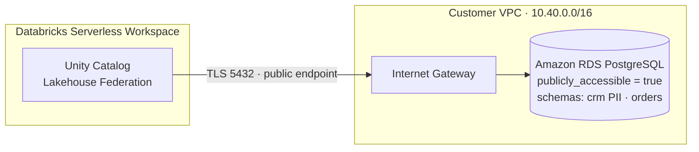

# AWS — Δημόσια σύνδεση (public connectivity)

Δείχνει πώς το Databricks διαβάζει την RDS στη **δημόσια** λειτουργία: Lakehouse Federation
πάνω από το δημόσιο endpoint της βάσης, με TLS. Απλή, άμεση διαδρομή.

---

## PROMPT (copy-paste στο ChatGPT)

```
Create a clean, professional cloud architecture diagram titled "AWS — Public Connectivity".
Horizontal left-to-right flow. Modern flat style, generous whitespace, thin connector lines
with arrowheads, rounded rectangle nodes, a light background. Use AWS-style service iconography
and a restrained palette (AWS orange accents, blues and greys). Every label must be sharp and
legible — do not paraphrase the labels below.

Left to right, show this data path:

1. A node labeled "Databricks Serverless Workspace" (Databricks-managed network), with a
   sub-label "Unity Catalog · Lakehouse Federation".

2. A single arrow crossing the public internet — label the arrow
   "TLS 5432 · public endpoint (sslmode=require)". Draw a small cloud/internet glyph on this arrow
   to make clear the traffic leaves over the public network.

3. A box labeled "Customer VPC (10.40.0.0/16)" containing:
   - an "Internet Gateway" at its edge
   - an "Amazon RDS for PostgreSQL" node with the sub-label
     "sales-db-instance · publicly_accessible = true"
   - a small tag on the RDS node: "schemas: crm (PII), orders"

4. Above the whole flow, a thin banner labeled
   "One JSON contract → grants enforced in Unity Catalog".

Keep it uncluttered — this is the SIMPLE case. No load balancer, no proxy, no PrivateLink.
The point of the picture is that in public mode the database is reachable directly over its
public endpoint, protected only by TLS and security-group rules.

Aspect ratio 16:9.
```

---

## 🎯 Ατάκα αφήγησης για αυτό το πλάνο

> *«Στη δημόσια λειτουργία, το Databricks φτάνει τη βάση κατευθείαν — πάνω από το δημόσιο
> endpoint της, με TLS. Απλό, γρήγορο, και αρκετό για dev. Αλλά τα bytes ταξιδεύουν στο δημόσιο
> δίκτυο. Γι' αυτό υπάρχει και η ιδιωτική λειτουργία.»*

---

## 💡 Εναλλακτική — Mermaid (καθαρότερα labels)

Αν θες τέλειο κείμενο, ζήτα από το ChatGPT: *"Instead of an image, give me this as a Mermaid
`flowchart LR` diagram"*, ή χρησιμοποίησε αυτό απευθείας στο mermaid.live:


