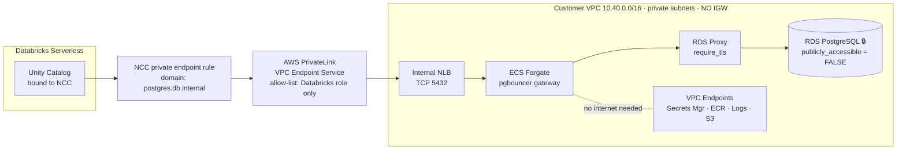

# AWS — Ιδιωτική σύνδεση (private connectivity)

Η πλήρης διαδρομή που χτίσαμε: Databricks serverless → NCC private endpoint rule → AWS PrivateLink
→ internal NLB → ECS Fargate pgbouncer → RDS Proxy → **ιδιωτική** RDS. Κανένα byte στο δημόσιο
δίκτυο, καμία δημόσια IP στη βάση.

---

## PROMPT (copy-paste στο ChatGPT)

```
Create a detailed, professional cloud architecture diagram titled "AWS — Private Connectivity
(PrivateLink)". Horizontal left-to-right flow. Modern flat style, generous whitespace, thin
connector lines with arrowheads, rounded rectangle nodes, light background. AWS-style service
iconography, restrained palette (AWS orange accents, blues, greys). A subtle green padlock motif
to signal "private / no public internet". Every label must be sharp and legible — do NOT
paraphrase the labels below.

Show this exact left-to-right data path. Draw it as ONE continuous private channel; nowhere does
the traffic touch the public internet (make that visually obvious — no internet cloud glyph
anywhere).

1. "Databricks Serverless Workspace" node, sub-label "Unity Catalog · bound to NCC".
   NCC = "Network Connectivity Config".

2. Arrow labeled "NCC private endpoint rule → postgres.db.internal" into:

3. "AWS PrivateLink" — draw as a secure private tunnel. Label it
   "VPC Endpoint Service (allow-list: Databricks serverless role only)".

4. Into a box labeled "Customer VPC (10.40.0.0/16) · private subnets, NO Internet Gateway"
   containing this chain, left to right:
   - "Internal Network Load Balancer (TCP 5432)"
   - "ECS Fargate task: pgbouncer gateway" (a container icon)
   - "Amazon RDS Proxy (require_tls)"
   - "Amazon RDS for PostgreSQL — publicly_accessible = FALSE" with a green padlock and the
     sub-label "security group admits 5432 only from the gateway"

5. Off to the side, inside the same VPC, draw a small cluster of 5 VPC Endpoints labeled
   "VPC Interface/Gateway Endpoints: Secrets Manager · ECR · CloudWatch Logs · S3" with a note
   "so the gateway needs no internet to pull its image or read secrets".

6. A thin banner across the top: "Every hop private — Databricks never leaves the AWS backbone".

Make the contrast with public mode implicit: a locked, multi-hop private channel versus a direct
public endpoint. Emphasize the padlock on the RDS node and the absence of any Internet Gateway.

Aspect ratio 16:9.
```

---

## 🎯 Ατάκα αφήγησης για αυτό το πλάνο

> *«Στην ιδιωτική λειτουργία, η βάση χάνει τη δημόσια διεύθυνσή της εντελώς. Το Databricks δεν
> φτάνει πια μέσω internet — φτάνει μέσω PrivateLink: ένα ιδιωτικό κανάλι που καταλήγει σε έναν
> load balancer, έναν gateway σε container, έναν connection proxy, και μόνο τότε στη βάση. Πέντε
> hops, όλα ιδιωτικά, κανένα byte στο δημόσιο δίκτυο. Και η allow-list δέχεται μόνο έναν ρόλο —
> τον ρόλο της Databricks. Κανένας άλλος λογαριασμός δεν μπαίνει.»*

---

## 💡 Εναλλακτική — Mermaid (καθαρότερα labels, συνιστάται για κάτι τόσο σύνθετο)



Κάν' το render στο mermaid.live και θα έχεις **τέλεια** labels — ιδανικό για ένα τόσο σύνθετο
διάγραμμα όπου μια AI raster εικόνα συχνά μπερδεύει τα ονόματα.
*(Ή, καλύτερα: ζήτα **SVG** — δες το [README](README.md).)*

---

## 🔎 Επαληθευμένα

| | |
|---|---|
| NCC domain | `postgres.db.internal` |
| VPC | `10.40.0.0/16` · private subnets · **χωρίς Internet Gateway** |
| Gateway | ECS Fargate — **pgbouncer** (connection pooler) |
| RDS Proxy | `require_tls = true` |
| RDS | `sales-db-instance` · **`publicly_accessible = false`** |
| Schemas | `crm` (PII: όνομα, email, τηλέφωνο) · `orders` |
| Federated catalog | `sales_rds_fed` (FOREIGN) |

## 🎁 Η λεπτομέρεια που αξίζει δικό της καρέ

Το allow-list του PrivateLink δέχεται **έναν** principal:

```
arn:aws:iam::565502421330:role/private-connectivity-role-eu-central-1
```

Τρία πράγματα που το κάνουν ιστορία:

1. **Ήταν `"*"`.** Μαζί με `acceptance_required = false`, αυτό σήμαινε ότι *οποιοσδήποτε* λογαριασμός
   AWS στην περιοχή μπορούσε να φτιάξει endpoint σ' αυτό το NLB, να φτάσει το gateway, και να
   μιλήσει Postgres σε μια βάση της οποίας **ο λόγος ύπαρξης της ιδιωτικότητας** είναι ότι κανείς
   δεν πρέπει.
2. **Και δεν θα δούλευε καν.** Το Databricks δεν ζητάει απλώς άδεια — **επαληθεύει** το allow-list
   πριν καν επιχειρήσει το endpoint, και ψάχνει **ένα ακριβές ARN**. Το `"*"` δεν είναι αυτό το
   string, άρα κόβεται κι αυτό.
3. **Ο λογαριασμός `565502421330` δεν είναι** ο λογαριασμός του workspace cross-account role. Είναι
   ο *serverless-PrivateLink* λογαριασμός της Databricks. Και τα δύο λάθη αποτυγχάνουν πανομοιότυπα,
   με σφάλμα που κατονομάζει το endpoint service και **όχι** το ARN που δεν βρήκε.

> 🗣️ *«Η αυστηρότερη δυνατή παραχώρηση και η μόνη που δουλεύει, είναι η ίδια παραχώρηση.»*
