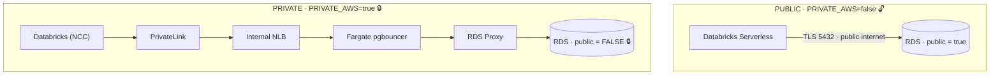

# AWS — Δημόσια vs Ιδιωτική, δίπλα-δίπλα

Η **μία εικόνα** που εξηγεί όλο το επιχείρημα: ίδιος στόχος (Databricks διαβάζει την RDS), δύο
τελείως διαφορετικές διαδρομές. Το πιο δυνατό πλάνο για να δείξεις ότι η συνδεσιμότητα είναι
ένας διακόπτης (`PRIVATE_AWS=true`), όχι ξαναγράψιμο.

> **Σημείωση εμβέλειας:** αυτό είναι το **AWS** αντίθετο. Οι διακόπτες είναι **τρεις** —
> `PRIVATE_AWS`, `PRIVATE_AZURE`, `PRIVATE_GCP` — και δουλεύουν **ανεξάρτητα** (κάθε cloud δέχεται
> `skip` \| `public` \| `private`). Το ίδιο επιχείρημα για τα άλλα δύο clouds είναι πιο εντυπωσιακό,
> γιατί εκεί η ιδιωτική διαδρομή περνάει από **transit hub και IPsec tunnel**: δες τα
> [`06`](06-azure-private-connection.md), [`07`](07-gcp-private-connection.md) και το hero
> [`09`](09-three-clouds-private-hero.md).

---

## PROMPT (copy-paste στο ChatGPT)

```
Create a professional "before / after" comparison architecture diagram, split into two stacked
panels that share the same width. Modern flat style, generous whitespace, light background,
AWS-style iconography, restrained palette (AWS orange, blues, greys). Labels must be sharp and
legible — do not paraphrase.

Title at the very top: "Same goal, one switch: PRIVATE_AWS = false | true".

TOP PANEL — label it "PUBLIC" with a small open-padlock (unlocked) icon:
  A short, direct left-to-right flow:
  "Databricks Serverless" → (arrow over a small internet cloud, labeled "TLS 5432 · public
  endpoint") → "Amazon RDS PostgreSQL · publicly_accessible = true".
  Keep it visibly SIMPLE — two nodes and one hop.

BOTTOM PANEL — label it "PRIVATE" with a closed green padlock icon:
  A longer left-to-right private channel, NO internet cloud anywhere:
  "Databricks Serverless (NCC)" → "AWS PrivateLink (VPC Endpoint Service)" →
  "Internal NLB" → "ECS Fargate: pgbouncer" → "RDS Proxy" →
  "Amazon RDS PostgreSQL · publicly_accessible = FALSE 🔒".
  Draw the whole bottom channel inside a shaded box labeled
  "Customer VPC · private subnets · no Internet Gateway".

The visual contrast is the message: the top is a short hop over the public internet; the bottom
is a long, fully-private, multi-hop channel that never leaves the AWS backbone. Same source, same
destination, same data — different path, flipped by a single flag.

Aspect ratio 16:9 (or 4:5 portrait if the two stacked panels fit better).
```

---

## 🎯 Ατάκα αφήγησης — η δυνατή

> *«Ίδιος στόχος: το Databricks διαβάζει την ίδια βάση. Πάνω, η δημόσια διαδρομή — ένα άλμα πάνω
> από το internet, με TLS. Κάτω, η ιδιωτική — PrivateLink, load balancer, gateway, proxy, και μόνο
> τότε η βάση, χωρίς δημόσια IP, χωρίς Internet Gateway, χωρίς ένα byte στο δημόσιο δίκτυο. Και το
> μόνο που άλλαξε ανάμεσά τους είναι μία σημαία: `PRIVATE_AWS = true`. Δεν ξαναέγραψα την
> πλατφόρμα — της γύρισα έναν διακόπτη.»*

---

## 💡 Εναλλακτική — Mermaid


