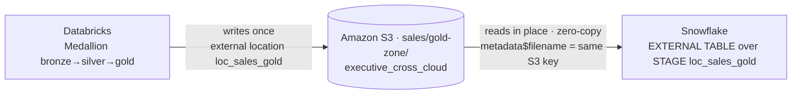

# Zero-copy — ένα gold layer, δύο μηχανές, μηδέν αντίγραφα

Το πλάνο που εξηγεί γιατί υπάρχει Snowflake στο project: το Databricks γράφει το gold layer **μία
φορά** σε S3 Parquet· το Snowflake το διαβάζει **εκεί που είναι**, μέσω external stage. Καμία
αντιγραφή, καμία απόκλιση, ίδια grants από το ίδιο JSON contract.

---

## PROMPT (copy-paste στο ChatGPT)

```
Create a clean, professional cloud architecture diagram titled "One Gold Layer, Two Engines,
Zero Copies". Modern flat style, generous whitespace, light background, restrained palette
(AWS orange, Databricks red, Snowflake blue, greys). Labels must be sharp and legible — do not
paraphrase.

Center of the diagram: a single prominent storage node — "Amazon S3 · sales/gold-zone/" — showing
a Parquet file icon labeled "executive_cross_cloud". This is the one source of truth; everything
points AT it, nothing copies FROM it.

Left side: "Databricks · Medallion (bronze → silver → gold)" with a WRITE arrow into the S3 gold
node, labeled "writes once — external location loc_sales_gold".

Right side: "Snowflake" with a READ arrow FROM the same S3 gold node, labeled
"EXTERNAL TABLE demo.executive_cross_cloud over STAGE loc_sales_gold · reads in place (zero-copy)".

Make it unmistakable that BOTH engines touch the SAME file: the Databricks write-arrow and the
Snowflake read-arrow meet at the identical S3 Parquet object. Add a small callout on the
Snowflake read-arrow: "SELECT metadata$filename → the exact same S3 key".

Top banner: "One JSON governance contract → enforced in BOTH Unity Catalog and Snowflake".

The message of the picture: the data is written once and read by two independent engines in
place — no ingestion, no second copy, no divergence.

Aspect ratio 16:9.
```

---

## 🎯 Ατάκα αφήγησης

> *«Το gold layer γράφτηκε μία φορά, από το Databricks, σε S3 Parquet. Το Snowflake δεν το
> αντιγράφει — το διαβάζει εκεί που είναι, με ένα external stage. Ίδιο αρχείο, δύο μηχανές, μηδέν
> αντίγραφα. Και οι δύο επιβάλλουν τα ίδια grants, που προέρχονται από το ίδιο JSON contract.»*

---

## 💡 Εναλλακτική — Mermaid



---

## 🔎 Τα ονόματα, επαληθευμένα στον κώδικα

Μη τα παραφράσεις — αυτά είναι τα πραγματικά:

| | |
|---|---|
| External location (Databricks) | `loc_sales_gold` → `databricks-project/sales/gold-zone/` |
| Stage (Snowflake) | `loc_sales_gold` — **το ίδιο όνομα, το ίδιο S3 prefix** |
| External table (Snowflake) | `demo.executive_cross_cloud` |
| Gold table (Databricks) | `sales_aws.gold.executive_cross_cloud` |

*(Το ότι το stage και το external location μοιράζονται όνομα **δεν** είναι σύμπτωση — και τα δύο
παράγονται από το ίδιο JSON contract. Αξίζει να το πεις.)*
